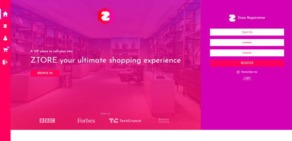
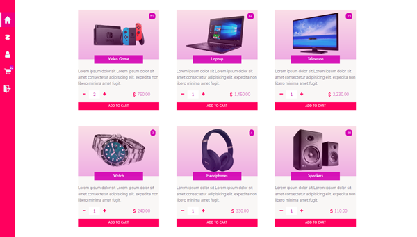

<!-- https://raw.githubusercontent.com/dbader/readme-template/master/README.md -->
# Ztore - a high-end online market
> Ztore is a functional prototype for an online shopping mall. 



### Technologies

* **JDBC to MYSQL database**
* **Connection pool pattern**
* ** REST API server in Jersey/Java**
* **Fron end as  a One page application in ES6**
* **Ajax functionality for performance**
* **And a beautiful UI Design**

```sh
It was the final project for SAIT's Advanced Web Development Course
```

##### Warning
The REST API is not available for distribution yet. So this app will not work as It was intended.
Once my school workload ends next april, I may add a GraphQL API and a Node.js server.



