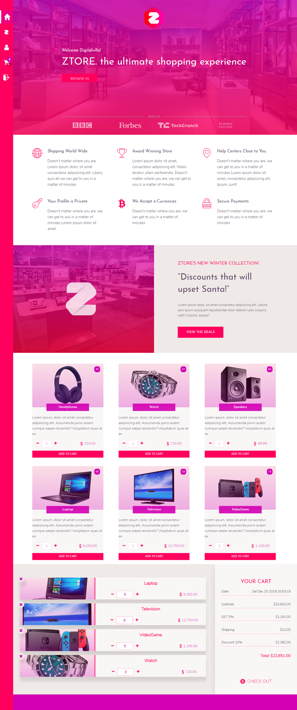

<!-- https://raw.githubusercontent.com/dbader/readme-template/master/README.md -->
# Ztore - Online Mall
> Ztore is a functional prototype for an online shopping mall. 

## ABOUT
This is only the front End of "Ztore" to make it functional you need to deploy [Ztore's RESTful API](https://github.com/DigitalVilla/ZtoreAPI). 

<!-- * JDBC to MYSQL database -->
<!-- * Connection pool pattern. -->
<!-- * REST API server in Jersey/Java -->
* Fron-End application in ES6
* Ajax functionality for performance
* SessionStorage and dynamic content
* Beautiful SASS UI design
* All from scratch with no Bootstrap or React 

### Refractor
* Implement ES6 IMPORT and node's REQUIRE
* Deploy using Node instead of Tomcat

##### Warning: Beware of CORS! :D

